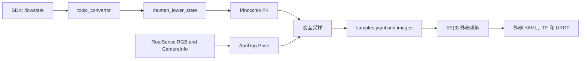

# Qiling S4 Hand-Eye Calibration

基于 ROS 2 Humble 的启灵 S4 双臂拖动示教与手眼标定工程。项目支持单相机 AprilTag 检测、交互式多位姿采样、Pinocchio FK、眼在手上/眼在手外外参求解及眼在手上一致性验证。

> **安全提示**：`drag_teach_bringup.launch.py` 默认会启用 SDK command。首次上机应托住手臂并使用 `control_enabled:=false`；发现异常立即执行 `ros2 param set /s4_drag_teach_controller control_enabled false`。

## 1. 系统流程



采样过程：按住手柄按键拖动手臂，松开后进入 HOLD；确认 Tag 可见后按 `c` 采集，按 `n` 接受或 `r` 丢弃。默认采集 17 组，每次自动生成时间戳目录。

## 2. 依赖

- Ubuntu 22.04、ROS 2 Humble、`colcon`
- ROS 2：`rclpy` `realsense2_camera` `cv_bridge` `joy` `tf2_ros`
- Python：`numpy` `scipy` `opencv-contrib-python/OpenCV aruco` `PyYAML`
- 机器人：Pinocchio
- 项目内消息/接口：`qi` `mit_msgs` `topic_convertor`
- Xbox 360 兼容手柄

检查关键依赖：

```bash
python3 -c "import cv2, numpy, scipy, yaml, pinocchio; print('dependencies OK')"
ros2 pkg prefix realsense2_camera
```

## 3. 构建

```bash
cd ~/project/qiling_hand_eye
source /opt/ros/humble/setup.bash

colcon build --symlink-install --packages-up-to \
  topic_convertor s4_command_tools s4_vision_bringup \
  s4_handeye_calibration qi_robot_description

source install/setup.bash
```

## 4. 拖动示教

```bash
# 首次调试：启动状态桥和控制器，但不发送 SDK command
ros2 launch s4_command_tools drag_teach_bringup.launch.py \
  enable_sdk_command:=false control_enabled:=false

# 已完成实机验证后的正常启动
ros2 launch s4_command_tools drag_teach_bringup.launch.py
```

- `A` 键：按住拖动左臂，松开锁存左臂位姿。
- `B` 键：按住拖动右臂，松开锁存右臂位姿。
- 控制器以 50 Hz 发布 26 维 MIT command：12 个下肢关节保持启动姿态，14 个手臂关节进行 DRAG/HOLD。

MIT 命令形式为：

```text
tau = kp * (q_des - q) + kd * (dq_des - dq) + tau_gravity
```

DRAG 时 `q_des` 跟随实测角度并使用低增益；松键时锁存当前角度，HOLD 使用每关节增益和 Pinocchio 重力前馈。参数位于 `src/s4_command_tools/config/drag_teach_joints.yaml`。

## 5. 相机与 AprilTag

每次只启动一台相机。使用 `rs-enumerate-devices -s` 查询序列号，然后启动：

```bash
CAMERA_SERIAL=replace_with_serial_number

ros2 launch s4_vision_bringup single_camera_apriltag.launch.py \
  serial_no:="'${CAMERA_SERIAL}'" \
  tag_family:=tag36h11 tag_id:=10 tag_size:=0.107
```

默认输出：

```text
/handeye_camera/camera/color/image_raw
/handeye_camera/camera/color/camera_info
/handeye_camera/tag10_pose
```

## 6. 右臂眼在手上

安装方式：相机刚性安装在右手，AprilTag 固定在机器人外部。采样期间不得移动 Tag 或相机安装件。

```bash
# 采集：使用 B 键拖动右臂
ros2 run s4_handeye_calibration interactive_sample_recorder --ros-args \
  -p session_root_dir:=/home/coral/project/qiling_hand_eye/samples/right_eye_in_hand \
  -p tracked_frames:="['RH_hand_base_link']" \
  -p max_samples:=17 -p tag_size:=0.107

# 求解：设置为采样器打印的时间戳目录
SESSION=/absolute/path/to/right_eye_in_hand/session
ros2 run s4_handeye_calibration handeye_calibrate -- \
  --samples ${SESSION}/samples.yaml \
  --mode eye_in_hand --tool-frame RH_hand_base_link --tag-name tag10 \
  --recompute-fk \
  --joint-sign-overrides right_shoulder_yaw_joint=-1 \
  --output ${SESSION}/right_eye_in_hand.yaml
```

`right_shoulder_yaw_joint=-1` 是已通过右臂实验确认的 SDK 角度到 URDF 角度的 FK 映射。仅在确认样本异常后才使用 `--exclude-samples 3,10` 一类参数，不要照搬历史样本编号。

## 7. 左臂眼在手上

安装方式：相机刚性安装在左手，AprilTag 固定在机器人外部。

```bash
# 采集：使用 A 键拖动左臂
ros2 run s4_handeye_calibration interactive_sample_recorder --ros-args \
  -p session_root_dir:=/home/coral/project/qiling_hand_eye/samples/left_eye_in_hand \
  -p tracked_frames:="['LH_hand_base_link']" \
  -p max_samples:=17 -p tag_size:=0.107

SESSION=/absolute/path/to/left_eye_in_hand/session
ros2 run s4_handeye_calibration handeye_calibrate -- \
  --samples ${SESSION}/samples.yaml \
  --mode eye_in_hand --tool-frame LH_hand_base_link --tag-name tag10 \
  --recompute-fk \
  --output ${SESSION}/left_eye_in_hand.yaml
```

左臂尚未用视觉相对运动完成全部电机方向校验；如发现 FK/视觉相对运动不一致，应先确定对应关节符号，再通过 `--joint-sign-overrides joint_name=-1` 显式修正，不应直接复制右臂映射。

## 8. 眼在手外

安装方式：相机固定在头部或外部支架，AprilTag 刚性固定在被采样的左手或右手上。相机和 Tag 的安装关系在采样期间必须保持不变。

> 固定相机且将 Tag 也固定在桌面上时，机器人运动不能为当前眼在手外求解器提供有效手眼约束。

```bash
# 示例：头部相机 + Tag 固定在右手，使用 B 键采集
ros2 run s4_handeye_calibration interactive_sample_recorder --ros-args \
  -p session_root_dir:=/home/coral/project/qiling_hand_eye/samples/right_eye_to_hand \
  -p tracked_frames:="['RH_hand_base_link']" \
  -p max_samples:=17 -p tag_size:=0.107

SESSION=/absolute/path/to/right_eye_to_hand/session
ros2 run s4_handeye_calibration handeye_calibrate -- \
  --samples ${SESSION}/samples.yaml \
  --mode eye_to_hand --tool-frame RH_hand_base_link --tag-name tag10 \
  --recompute-fk \
  --joint-sign-overrides right_shoulder_yaw_joint=-1 \
  --output ${SESSION}/right_eye_to_hand.yaml
```

左手眼在手外标定时将 tool frame 换为 `LH_hand_base_link`，并按左臂实际 FK 映射决定是否需要 `--joint-sign-overrides`。

## 9. 核心算法

### 9.1 拖动示教

控制器读取 26 维 `q/dq`，以 50 Hz 输出 MIT command。左右臂使用独立状态机：`A` 键控制左臂，`B` 键控制右臂。

```text
DRAG：按住按键
  q_des = q_measured
  dq_des = 0
  使用低 kp/kd 和每关节重力前馈

HOLD：松开按键
  q_hold = clamp(q + dq * prediction_time, joint_limits)
  q_des = q_hold
  dq_des = 0
  使用每关节 hold_kp/hold_kd 和重力前馈
```

电机控制律为：

```text
tau = kp * (q_des - q) + kd * (dq_des - dq) + gravity_scale * tau_g(q)
```

`tau_g(q)` 由 Pinocchio 计算并按关节限幅。12 个下肢关节在拖动期间持续保持启动时角度；手柄超时、状态超时或安全检查失败时，手臂退出主动拖动。

### 9.2 眼在手上

对每组样本：

```text
T_base_tool_i * T_tool_camera * T_camera_tag_i = T_base_tag
```

联合优化常量 `T_tool_camera` 和 `T_base_tag`。

### 9.3 眼在手外

```text
T_base_tool_i * T_tool_tag = T_base_camera * T_camera_tag_i
```

联合优化常量 `T_base_camera` 和 `T_tool_tag`。

两种模式均先构造 SE(3) 闭环误差变换：

```text
E_i = inv(T_expected_i) * T_actual_i
```

对于眼在手上：

```text
T_expected_i = T_base_tag
T_actual_i   = T_base_tool_i * T_tool_camera * T_camera_tag_i
```

对于眼在手外：

```text
T_expected_i = T_base_tool_i * T_tool_tag
T_actual_i   = T_base_camera * T_camera_tag_i
```

理想情况下 `E_i` 为单位变换。实现中将其转换为 6 维残差：

```text
e_i = [rho_x, rho_y, rho_z, phi_x, phi_y, phi_z]

rho_i = translation(E_i)       # 平移闭环误差，单位 m
phi_i = Log_SO3(rotation(E_i)) # 旋转向量误差，单位 rad
```

其中 `Log_SO3` 将旋转矩阵转换为旋转轴乘旋转角。项目默认旋转权重为 1.0，将所有样本的 6 维残差拼接后求解：

```text
minimize sum soft_l1(e_i)
```

求解器使用 `scipy.optimize.least_squares`、`soft_l1` 鲁棒损失和 0.05 的 `f_scale`，同时优化外参与固定物位姿。最后按样本统计 `||rho_i||` 和 `||phi_i||` 的 RMSE/最大值，并将外参、求解状态和残差写入 YAML。

## 10. 验证

### 10.1 眼在手上独立验证

将 Tag 固定在任意新位置，另外采集 10 组；前 5 组建立新的 `T_base_tag` 参考，后 5 组独立评估。

```bash
CALIBRATION_SESSION=/absolute/path/to/calibration/session
VALIDATION_SESSION=/absolute/path/to/validation/session

ros2 run s4_handeye_calibration handeye_validate -- \
  --samples ${VALIDATION_SESSION}/samples.yaml \
  --calibration ${CALIBRATION_SESSION}/right_eye_in_hand.yaml \
  --tool-frame RH_hand_base_link --tag-name tag10 \
  --reference-count 5 --recompute-fk \
  --joint-sign-overrides right_shoulder_yaw_joint=-1 \
  --output ${VALIDATION_SESSION}/validation_report.yaml
```

左臂验证将 tool frame 和 calibration 文件换为左臂结果，并使用左臂已确认的 FK 方向映射。

### 10.2 眼在手外验证

保持相机和 Tag 安装关系不变，采集一批未参与求解的新位姿，对每组计算：

```text
T_base_camera_i
= T_base_tool_i * T_tool_tag * inv(T_camera_tag_i)
```

统计所有 `T_base_camera_i` 的平移和旋转离散度；也可对独立数据重新求解，比较两次 `T_base_camera` 的差异。

### 10.3 TF 检查

```bash
CALIBRATION=/absolute/path/to/calibration.yaml

ros2 run s4_handeye_calibration publish_calibration_tf -- \
  --calibration ${CALIBRATION} \
  --child-frame calibrated_camera_color_optical_frame
```

TF 发布只检查坐标树和数值是否正确加载，不能代替独立位姿精度验证。

## 11. 当前右臂结果

- 最终外参：`samples/20260731_150143/eye_in_hand_result_filtered.yaml`
- 标定内部残差：8.684 mm / 1.247°
- 新位置独立一致性：20.798 mm / 1.677°
- 完整实验报告：`right_arm_eye_in_hand_calibration_report.txt`
- 带外参的完整模型：`src/qi_robot_description/urdf/s4_40DOF_fullbody_with_handeye_camera.urdf`

上述误差是 FK、视觉解算和手眼外参组成的闭环一致性指标，不是外参相对计量学真值的绝对误差。
