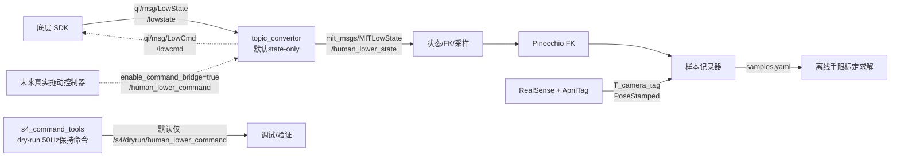
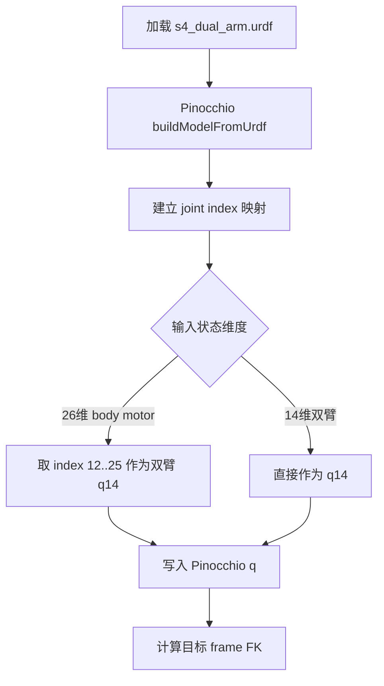
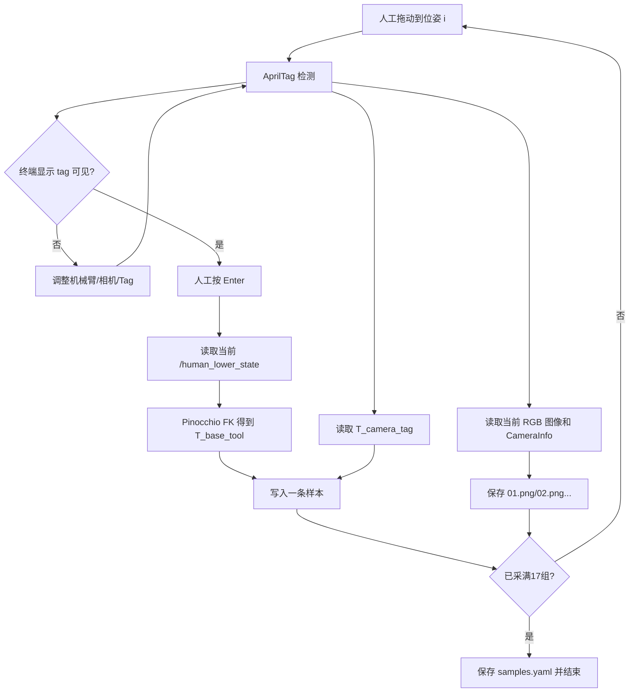
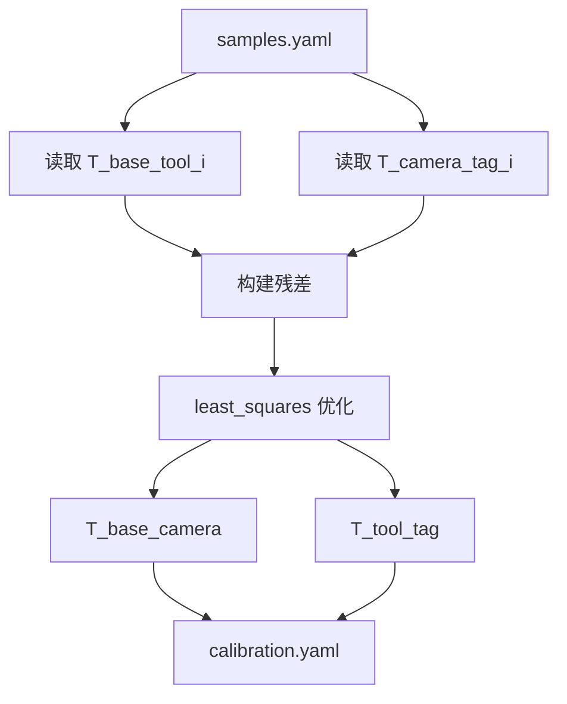
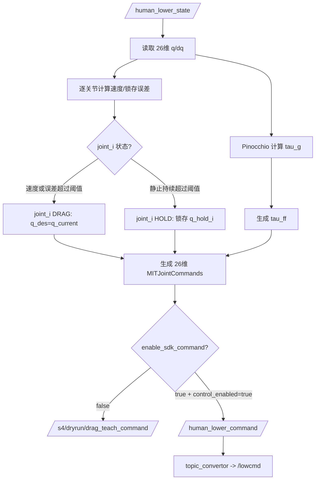

# qiling_hand_eye 项目实现流程与算法逻辑

本文档只描述当前项目的实现流程、模块边界和算法逻辑。当前已完成 `/lowstate -> /human_lower_state` 只读状态链路验证；SDK command 链路仍未启用，也不做电机命令验证。

## 1. 当前实现状态

### 已实现

- URDF 模型检查：
  - `src/qi_robot_description/urdf/s4_dual_arm.urdf` 可被 `check_urdf` 正常解析。
  - mesh 引用路径检查通过。
  - 模型包含 14 个双臂可动关节，固定下肢和固定灵巧手。

- SDK 消息与通信基础：
  - `qi` 消息包已纳入 workspace。
  - `mit_msgs` 已存在。
  - `topic_convertor` 已存在，用于 `mit_msgs <-> qi/msg/*` 转换。
  - `topic_convertor` 已改为默认 state-only：`enable_state_bridge=true`，`enable_command_bridge=false`。
  - 已完成 `/lowstate -> /human_lower_state` 在线验证。
  - 验证时 `/human_lower_state` 可收到 26 维状态，频率约 900-1000 Hz。
  - 已确认 state-only 模式不会创建 `mit_to_qisn_converter` 的 `/lowcmd` publisher。
  - 通信相关包已构建通过：

```bash
colcon build --symlink-install --packages-select qi mit_msgs topic_convertor s4_command_tools
```

- 50 Hz dry-run 保持命令工具：
  - 包：`s4_command_tools`
  - 节点：`hold_command_publisher`
  - 默认只发布 `/s4/dryrun/human_lower_command`
  - 默认不发布 `/human_lower_command`
  - 不会经 `topic_convertor` 转发到 `/lowcmd`

- 拖动示教与手眼标定算法基础：
  - 包：`s4_handeye_calibration`
  - Pinocchio FK 工具
  - 26 维 body motor 状态到 14 维双臂状态映射
  - 拖动/标定样本记录节点
  - 交互式手眼样本记录节点
  - 交互采样时保存 AprilTag 检测绘制后的 OpenCV debug image，默认保存到 `samples/images`
  - 交互采样默认采集 17 组，文件名按 `01.png`、`02.png` ... 顺序生成，到 17 组后自动保存并退出
  - 眼在手上 `eye_in_hand` 离线求解
  - 眼在手外 `eye_to_hand` 离线求解
  - 标定结果完整打印并写入输出 YAML
  - 标定 YAML 静态 TF 发布工具
  - 合成数据标定求解验证通过

- 单相机视觉接入：
  - 包：`s4_vision_bringup`
  - Launch：`single_camera_apriltag.launch.py`
  - 每次只启动一个指定相机。
  - AprilTag 检测节点输出 `geometry_msgs/PoseStamped`。
  - 默认参数：
    - `tag_family=tag36h11`
    - `tag_id=10`
    - `tag_size=0.075`

### 尚未实现

- 真实拖动示教控制：
  - 已实现 50 Hz 拖动示教控制节点 `drag_teach_controller`。
  - 默认只发布 dry-run topic，不向 SDK 发布真实命令。
  - 已实现上肢 MIT 低刚度/重力补偿命令生成。
  - 尚未实现软限位、急停、超时保护的真机控制状态机。

- 相机与 AprilTag 在线链路：
  - 已实现单相机 bringup 和 AprilTag PoseStamped 输出节点。
  - 已实现交互式样本记录器对 `/handeye_camera/tag10_pose` 和相机图像 topic 的接入。
  - 尚未在真实相机画面中验证 tag 检测效果。

- 自动 IK 与轨迹回放：
  - 当前手眼标定可先不依赖 IK 和轨迹规划。
  - DLS IK 与 Ruckig 回放规划属于后续自动采样/轨迹回放阶段。

## 2. 总体架构



安全边界：

- 当前算法包只订阅状态和视觉位姿，并写入 YAML 文件。
- 当前 dry-run 命令工具默认不发布真实 SDK command。
- 真实控制必须显式打开参数或新增真机控制状态机后才允许进入 `/human_lower_command -> /lowcmd` 链路。

## 3. 包职责

### `qi_robot_description`

职责：

- 提供 `s4_dual_arm.urdf`
- 提供 mesh 资源
- 为 Pinocchio、RViz、FK、标定提供机器人模型

可动关节顺序：

```text
left_shoulder_pitch_joint
left_shoulder_roll_joint
left_shoulder_yaw_joint
left_elbow_joint
left_wrist_roll_joint
left_wrist_pitch_joint
left_wrist_yaw_joint
right_shoulder_pitch_joint
right_shoulder_roll_joint
right_shoulder_yaw_joint
right_elbow_joint
right_wrist_roll_joint
right_wrist_pitch_joint
right_wrist_yaw_joint
```

### `qi`

职责：

- 提供 SDK topic 所需消息：
  - `qi/msg/LowCmd`
  - `qi/msg/LowState`
  - `qi/msg/MotorCmd`
  - `qi/msg/MotorState`
  - `qi/msg/IMUState`

### `mit_msgs`

职责：

- 提供上层 MIT 风格抽象消息：
  - `MITJointCommand`
  - `MITJointCommands`
  - `MITLowState`

### `topic_convertor`

职责：

- 将 `/lowstate` 转换为 `/human_lower_state`
- 将 `/human_lower_command` 转换为 `/lowcmd`

当前逻辑：

```text
/lowstate            qi/msg/LowState
  -> topic_convertor
  -> /human_lower_state mit_msgs/msg/MITLowState

/human_lower_command mit_msgs/msg/MITJointCommands
  -> topic_convertor
  -> /lowcmd           qi/msg/LowCmd
```

注意：

- 当前默认只启用状态桥：

```text
enable_state_bridge=true
enable_command_bridge=false
```

- command 桥必须显式打开才会创建 `/lowcmd` publisher。
- 默认期望 26 个 motor command。
- 上层若只发 14 个手臂 command，会被 strict size check 拒绝。
- 后续真机控制应发布 26 维命令：12 个下肢保持，14 个上肢控制。

### `s4_command_tools`

职责：

- 生成 50 Hz 26 维保持命令。
- 当前只用于 dry-run 验证，不接入 SDK。

默认数据流：

```text
/human_lower_state
  -> hold_command_publisher
  -> /s4/dryrun/human_lower_command
```

真实 command 默认关闭：

```text
enable_sdk_command=false
```

### `s4_handeye_calibration`

职责：

- 从 `/human_lower_state` 提取关节状态。
- 用 Pinocchio 计算左右末端 FK。
- 记录拖动示教与手眼标定样本。
- 离线求解眼在手上和眼在手外外参。

入口：

```bash
ros2 run s4_handeye_calibration fk_probe -- --positions ...
ros2 run s4_handeye_calibration sample_recorder
ros2 run s4_handeye_calibration interactive_sample_recorder
ros2 run s4_handeye_calibration handeye_calibrate -- --samples ... --mode ...
ros2 run s4_handeye_calibration publish_calibration_tf -- --calibration ...
```

## 4. 项目实现流程

### 阶段 A：模型与状态准备



输入：

- `/human_lower_state.joint_states.position`

输出：

- `q`
- `q14`
- `T_base_left_wrist_yaw_link`
- `T_base_right_wrist_yaw_link`
- `T_base_LH_hand_base_link`
- `T_base_RH_hand_base_link`

### 阶段 B：交互式拖动示教样本记录

真实标定推荐使用 `interactive_sample_recorder`，而不是固定频率自动记录。每一个样本都由人工确认后写入文件。



当前样本格式核心字段：

```yaml
metadata:
  format: s4_handeye_samples_v1
samples:
  - t: ...
    q: [...]
    q14: [...]
    dq: [...]
    tau_est: [...]
    frames:
      left_wrist_yaw_link: ...
      right_wrist_yaw_link: ...
      LH_hand_base_link: ...
      RH_hand_base_link: ...
    tag_poses:
      camera_or_tag_name: ...
    image:
      file: samples/images/01.png
      topic: /handeye_camera/camera/color/image_raw
      frame_id: ...
      stamp: ...
```

说明：

- 手眼标定时建议设置 `require_tags=true`，只有 tag 新鲜可见时才允许记录。
- 每条有效样本同时包含机器人末端位姿、视觉测得的 `T_camera_tag` 和当前带 AprilTag 框线/坐标轴的图像文件路径。
- 默认 `save_images=true`，采样器会在本地把 AprilTag 框线和坐标轴绘制到当前 RGB 图像上并保存。
- 如果 RGB 图像或 CameraInfo 尚未收到新鲜数据，则本次采样会被拒绝。
- 默认 `max_samples=17`，采满 17 组后自动保存 YAML 并退出。
- 终端会持续显示状态，例如：

```text
state=OK | tags=tag10:VISIBLE | image=OK | samples=3/17
[Enter/s/w/q] >
```

交互命令：

- `Enter`：记录当前样本。
- `s`：刷新状态。
- `w`：等待 tag 变为可见。
- `q`：保存文件并退出。

交互规则：

- 人工拖动到一个新位姿后，先观察终端中 `tags=tag10:VISIBLE`。
- 若 tag 不可见，调整机械臂、相机或 AprilTag 后再次查看状态。
- tag 可见且 `state=OK`、`image=OK`、`camera_info=OK` 后按 Enter。
- 程序会同时记录 `T_base_tool`、`T_camera_tag`，并保存带 AprilTag 投影绘制效果的当前相机画面。
- 采样成功后再拖动到下一个位姿；采满 17 组自动结束。

### 阶段 C：眼在手上标定

适用场景：

- 相机安装在左手或右手上。
- AprilTag 固定在外部环境。
- 标定过程中 AprilTag 不能移动，可以固定在桌面、支架或墙面。

已知量：

```text
T_base_tool_i
T_camera_tag_i
```

未知量：

```text
T_tool_camera
T_base_tag
```

约束方程：

```text
T_base_tool_i * T_tool_camera * T_camera_tag_i = T_base_tag
```

该求解器当前就是按照“相机随末端运动、tag 在世界中静止”的设定实现的。

流程：


残差：

```text
error_i = Log( inv(T_base_tag) * T_base_tool_i * T_tool_camera * T_camera_tag_i )
```

优化变量：

```text
x = [se3(T_tool_camera), se3(T_base_tag)]
```

输出：

```yaml
mode: eye_in_hand
T_tool_camera: ...
T_base_tag: ...
residuals:
  translation_rmse_m: ...
  rotation_rmse_rad: ...
```

### 阶段 D：眼在手外标定

适用场景：

- 相机固定在机器人外部。
- AprilTag 固定在末端工具或手爪上。
- 头部相机属于眼在手外：相机相对 `base_link` 固定，AprilTag 标定板应刚性固定在手部/末端并随手运动。

已知量：

```text
T_base_tool_i
T_camera_tag_i
```

未知量：

```text
T_base_camera
T_tool_tag
```

约束方程：

```text
T_base_tool_i * T_tool_tag = T_base_camera * T_camera_tag_i
```

该求解器当前就是按照“相机在外部固定、tag 随末端运动”的设定实现的。

其他可行方式：

- 若 AprilTag 固定在桌面且已知 `T_base_tag`，则可由 `T_base_camera = T_base_tag * inv(T_camera_tag)` 直接得到头部相机外参，不需要多位姿手眼求解。
- 若 AprilTag 固定在桌面但 `T_base_tag` 未知，同时相机也固定在头部，则机器人拖动不会改变 `T_camera_tag` 与 `T_base_tool` 之间的手眼约束，无法按当前 `eye_to_hand` 求解器求出 `T_base_camera`。

流程：



残差：

```text
error_i = Log( inv(T_base_tool_i * T_tool_tag) * T_base_camera * T_camera_tag_i )
```

优化变量：

```text
x = [se3(T_base_camera), se3(T_tool_tag)]
```

输出：

```yaml
mode: eye_to_hand
T_base_camera: ...
T_tool_tag: ...
residuals:
  translation_rmse_m: ...
  rotation_rmse_rad: ...
```

## 5. 拖动示教控制逻辑

当前已实现 `drag_teach_controller` 拖动-悬停状态机。默认仍可只输出 dry-run；真实 SDK command 必须显式打开。

上肢 14 个关节采用独立状态机：

- 每个关节独立维护 `DRAG/HOLD` 状态。
- 每个关节独立维护 `q_hold`。
- 每个关节独立判断拖动、静止和锁存。
- 每个关节的 `kp/kd/gravity_scale/effort_limit/阈值` 在 YAML 中配置。

配置文件：

```text
src/s4_command_tools/config/drag_teach_joints.yaml
```

真机拖动控制采用 50 Hz 低带宽、准静态协作拖动模式：

- `DRAG`：检测到人工拖动时，目标位置跟随当前关节位置，低刚度、重力补偿。
- `HOLD`：检测到关节速度低于阈值并持续一段时间后，锁存当前上肢位置并保持。

控制周期：

```text
dt = 0.02 s
rate = 50 Hz
```

MIT 模式基础公式：

```text
tau_sdk = kp * (q_des - q) + kd * (qd_des - qd) + tau_ff
```

`DRAG` 状态：

```text
q_des  = q_current
qd_des = 0
kp     = arm_kp，默认 0.0
kd     = arm_kd，默认 0.35
tau_ff = gravity_scale * tau_g(q_current)
```

`HOLD` 状态：

```text
q_des  = q_hold
qd_des = 0
kp     = hold_arm_kp，默认 5.0
kd     = hold_arm_kd，默认 0.6
tau_ff = gravity_scale * tau_g(q_current)
```

单关节状态切换：

```text
|dq_i| >= move_velocity_threshold_rad_s -> joint_i DRAG
|q_i - q_hold_i| >= hold_position_error_threshold_rad -> joint_i DRAG
|dq_i| <= still_velocity_threshold_rad_s 且持续 still_time_sec -> joint_i HOLD
```

默认阈值：

```text
move_velocity_threshold_rad_s  = 0.08
still_velocity_threshold_rad_s = 0.03
hold_position_error_threshold_rad = 0.04
still_time_sec                 = 0.4
```

控制流程：



安全要求：

- 默认不允许发布真实 `/human_lower_command`。
- `drag_teach_controller` 默认 `enable_sdk_command=false`，只输出 dry-run。
- 即使设置 `enable_sdk_command=true`，也必须同时设置 `control_enabled=true` 才会向 `/human_lower_command` 发布。
- 必须先确认 SDK `/lowstate` 正常发布、`/lowcmd` 正常订阅。
- 必须先验证 26 维 motor 顺序。
- 已加入状态超时、NaN/Inf 检查、速度/位置异常检查、上肢重力补偿力矩限幅。
- 50 Hz 下不追求高速力控，只做低速拖动、松手悬停和标定采样。
- 不是只发一个力矩字段，而是仍然发送完整 26 维 MIT 命令。
- 下肢 12 维保持启动时锁存位置；上肢 14 维执行逐关节 `DRAG/HOLD` 状态机。

## 6. IK 与轨迹规划逻辑

手眼标定第一阶段不需要 IK 和轨迹规划。

当前推荐流程：

```text
人工拖动 -> 记录 q/FK/tag pose -> 离线标定
```

IK 和轨迹规划用于后续自动化：

- 自动移动到标定姿态。
- 自动回放示教轨迹。
- 标定后自动验证外参。

未来 IK：

```text
dq = J^T * inv(J * J^T + lambda^2 I) * error
```

其中：

- `J` 来自 Pinocchio frame Jacobian。
- `error` 使用 SE(3) log。
- 每步限制最大关节增量。
- 接近关节限位时加入 nullspace limit avoidance。

未来轨迹规划：

- 使用 Ruckig 做速度、加速度、jerk 限制。
- 50 Hz 离散周期下设置 `dt = 0.02 s`。
- 轨迹回放前必须做离线限位和跳变检查。

## 7. 视觉与 AprilTag 接入逻辑

当前不单独实现相机 RGB/CameraInfo 发布器。

推荐使用：

```text
realsense2_camera
```

由 RealSense 官方节点发布：

```text
/<camera_ns>/color/image_raw
/<camera_ns>/color/camera_info
```

已新增轻量 bringup/config 包：

```text
s4_vision_bringup
```

职责：

- 每次只启动一个指定 RealSense 相机。
- 管理 camera namespace、camera name、serial number。
- 启动 OpenCV AprilTag detector。
- 输出 `geometry_msgs/PoseStamped`。
- 不发布 debug image；采样器在本地保存图片时绘制 AprilTag 框线和坐标轴。

AprilTag 检测输出需要转换为：

```text
geometry_msgs/PoseStamped
T_camera_tag
```

默认 AprilTag 参数：

```text
tag_family = tag36h11
tag_id     = 10
tag_size   = 0.075 m
```

输出 topic 默认：

```text
/handeye_camera/tag10_pose
```

然后接入 `sample_recorder` 的 `tag_pose_topics` 参数。

## 8. 推荐运行顺序

### 8.1 构建

```bash
colcon build --symlink-install --packages-select \
  qi mit_msgs topic_convertor s4_command_tools s4_handeye_calibration s4_vision_bringup
source install/setup.bash
```

### 8.2 状态桥只读验证

默认不会启用 command 桥：

```bash
ros2 run topic_convertor topic_converter_node
ros2 topic echo /human_lower_state --once
ros2 topic info -v /lowcmd
```

期望：

- `/human_lower_state` 能收到 26 维状态。
- `/lowcmd` 不出现 `mit_to_qisn_converter` publisher。
- 不发布 `/human_lower_command`。

### 8.3 FK 检查

```bash
ros2 run s4_handeye_calibration fk_probe -- --positions 0,0,0,0,0,0,0,0,0,0,0,0,0,0
```

### 8.4 启动单相机与 AprilTag

示例：

```bash
ROS_LOG_DIR=/tmp/ros_logs ros2 launch s4_vision_bringup single_camera_apriltag.launch.py \
  camera_namespace:=handeye_camera \
  camera_name:=camera \
  serial_no:="'<camera_serial>'" \
  tag_id:=10 \
  tag_family:=tag36h11 \
  tag_size:=0.075
```

输出：

```text
/handeye_camera/camera/color/image_raw
/handeye_camera/camera/color/camera_info
/handeye_camera/tag10_pose
```

前 4 步实机验证指令：

终端 1，启动指定单相机和 AprilTag：

```bash
source install/setup.bash
ROS_LOG_DIR=/tmp/ros_logs ros2 launch s4_vision_bringup single_camera_apriltag.launch.py \
  camera_namespace:=handeye_camera \
  camera_name:=camera \
  serial_no:="'<camera_serial>'" \
  tag_id:=10 \
  tag_family:=tag36h11 \
  tag_size:=0.075
```

终端 2，验证相机图像和 CameraInfo：

```bash
source install/setup.bash
ros2 topic list | grep handeye_camera
ros2 topic hz /handeye_camera/camera/color/image_raw
ros2 topic echo /handeye_camera/camera/color/camera_info --once
```

终端 2，验证 AprilTag pose：

```bash
ros2 topic echo /handeye_camera/tag10_pose --once
ros2 topic hz /handeye_camera/tag10_pose
```

终端 3，启动只读状态桥：

```bash
source install/setup.bash
ros2 run topic_convertor topic_converter_node --ros-args \
  -p enable_state_bridge:=true \
  -p enable_command_bridge:=false
```

终端 2，验证 `/human_lower_state`：

```bash
ros2 topic echo /human_lower_state --once
ros2 topic hz /human_lower_state
ros2 topic info -v /lowcmd
```

`/lowcmd` 检查时不应出现来自 `mit_to_qisn_converter` 的 publisher。

### 8.5 拖动示教控制 dry-run 验证

该步骤只发布 `/s4/dryrun/drag_teach_command`，不进入 SDK command 链路。

```bash
source install/setup.bash
ros2 launch s4_command_tools drag_teach_controller.launch.py \
  enable_sdk_command:=false \
  control_enabled:=false \
  publish_rate_hz:=50.0 \
  teach_mode:=drag_hold
```

另开终端检查：

```bash
source install/setup.bash
ros2 topic echo /s4/dryrun/drag_teach_command --once
ros2 topic hz /s4/dryrun/drag_teach_command
```

### 8.6 真实拖动示教控制

真实拖动示教需要先显式打开 `topic_convertor` command bridge，再显式打开 `drag_teach_controller` 的 SDK 输出。该步骤会向 SDK command 链路发命令，必须在人工确认安全后执行。

终端 1：

```bash
source install/setup.bash
ros2 run topic_convertor topic_converter_node --ros-args \
  -p enable_state_bridge:=true \
  -p enable_command_bridge:=true
```

终端 2：

```bash
source install/setup.bash
ros2 launch s4_command_tools drag_teach_controller.launch.py   enable_sdk_command:=true   control_enabled:=false   joint_config_path:=/home/coral/project/qiling_hand_eye/src/s4_command_tools/config/drag_teach_joints.yaml   gravity_scale:=0.3
```
```
ros2 param set /s4_drag_teach_controller control_enabled true
```

上肢各关节的 `kp/kd/gravity_scale/effort_limit/阈值` 默认从安装后的 YAML 读取：

```text
install/s4_command_tools/share/s4_command_tools/config/drag_teach_joints.yaml
```

开发时修改源文件：

```text
src/s4_command_tools/config/drag_teach_joints.yaml
```

修改后需要重新构建 `s4_command_tools` 或通过 `joint_config_path:=...` 指定源文件路径。

终端 3，确认安全后再打开真实控制：

```bash
source install/setup.bash
ros2 param set /s4_drag_teach_controller control_enabled true
```

先确认 `gravity_scale=0.0` 时启用后没有突然抬臂、下砸或跳变，再逐级增加重力补偿：

```bash
ros2 param set /s4_drag_teach_controller gravity_scale 0.1
ros2 param set /s4_drag_teach_controller gravity_scale 0.2
ros2 param set /s4_drag_teach_controller gravity_scale 0.3
```

需要立即停止时：

```bash
ros2 param set /s4_drag_teach_controller control_enabled false
```

### 8.7 只记录拖动样本

```bash
ros2 run s4_handeye_calibration sample_recorder --ros-args \
  -p state_topic:=/human_lower_state \
  -p output_file:=samples/drag_samples.yaml \
  -p sample_rate_hz:=5.0 \
  -p record_without_tags:=true
```

### 8.8 交互式记录手眼标定样本

每拖动到一个位姿后，先看终端中 tag 是否可见；确认可见后按 Enter 记录当前机器人 FK 和 `T_camera_tag`。

```bash
ros2 run s4_handeye_calibration interactive_sample_recorder --ros-args \
  -p state_topic:=/human_lower_state \
  -p output_file:=samples/handeye_left.yaml \
  -p tag_pose_topics:="['/handeye_camera/tag10_pose']" \
  -p tag_pose_names:="['tag10']" \
  -p require_tags:=true \
  -p image_topic:=/handeye_camera/camera/color/image_raw \
  -p camera_info_topic:=/handeye_camera/camera/color/camera_info \
  -p image_output_dir:=samples/images \
  -p image_extension:=png \
  -p draw_tag_overlay:=true \
  -p tag_size:=0.075 \
  -p max_samples:=17
```

终端交互：

```text
state=OK | tags=tag10:VISIBLE | image=OK | camera_info=OK | samples=3/17
[Enter/s/w/q] >
```

- `Enter`：记录当前样本，并保存当前相机画面为 `01.png`、`02.png` ...
- `s`：刷新状态。
- `w`：等待 tag 变为可见。
- `q`：保存文件并退出。

### 8.9 求解眼在手上

```bash
ros2 run s4_handeye_calibration handeye_calibrate -- \
  --samples samples/handeye_left.yaml \
  --mode eye_in_hand \
  --tool-frame LH_hand_base_link \
  --tag-name tag10 \
  --output calibration/left_eye_in_hand.yaml
```

程序会打印并写入 `T_tool_camera`、`T_base_tag` 和误差统计。

### 8.10 求解眼在手外

```bash
ros2 run s4_handeye_calibration handeye_calibrate -- \
  --samples samples/eye_to_hand.yaml \
  --mode eye_to_hand \
  --tool-frame LH_hand_base_link \
  --tag-name fixed_camera_tag \
  --output calibration/eye_to_hand.yaml
```

程序会打印并写入 `T_base_camera`、`T_tool_tag` 和误差统计。

### 8.11 发布静态 TF 并打印外参

眼在手上示例：

```bash
ros2 run s4_handeye_calibration publish_calibration_tf -- \
  --calibration calibration/left_eye_in_hand.yaml \
  --child-frame left_camera_color_optical_frame
```

眼在手外示例：

```bash
ros2 run s4_handeye_calibration publish_calibration_tf -- \
  --calibration calibration/eye_to_hand.yaml \
  --parent-frame base_link \
  --child-frame handeye_camera_color_optical_frame
```

该工具会：

- 发布静态 TF。
- 在终端打印 parent frame、child frame、translation、quaternion。
- 读取 `handeye_calibrate` 生成的 YAML；外参结果文件本身会保留在 `calibration/` 中。

## 9. 后续还需要进行的环节

### 9.1 实机视觉验证

目标：确认指定单个 RealSense 相机、CameraInfo 和 AprilTag pose 链路可用。

需要执行：

1. 获取三台 RealSense 的真实序列号。
2. 按序列号只启动本次要标定的一个相机。
3. 验证 RGB 图像 topic 正常发布。
4. 验证 CameraInfo topic 正常发布。
5. 在相机视野内放置 AprilTag，确认 `/handeye_camera/tag10_pose` 可以稳定输出。
6. 调整曝光、视角、tag 距离和光照，保证 tag pose 不频繁丢失。

验收标准：

- `/handeye_camera/camera/color/image_raw` 有稳定频率。
- `/handeye_camera/camera/color/camera_info` 能 echo 到一次完整内参。
- `/handeye_camera/tag10_pose` 在 tag 可见时稳定输出。
- AprilTag 参数与实物一致：

```text
tag_family = tag36h11
tag_id     = 10
tag_size   = 0.075 m
```

### 9.2 实机状态桥验证

目标：确认 SDK 只读状态链路稳定，且不触发 command 链路。

需要执行：

1. 启动 SDK 底层。
2. 启动 `topic_convertor`，保持 state-only：

```text
enable_state_bridge=true
enable_command_bridge=false
```

3. 验证 `/human_lower_state` 持续输出 26 维状态。
4. 检查 `/lowcmd`，确认没有来自 `mit_to_qisn_converter` 的 publisher。

验收标准：

- `/human_lower_state.joint_states.position` 为 26 维。
- 26 维 motor 顺序与项目关键配置一致。
- 该阶段不发布 `/human_lower_command`，不向 SDK 下发 command。

### 9.3 拖动示教 dry-run 验证

目标：先验证拖动示教控制节点输出的 MIT command 格式，不接入真实 SDK command。

需要执行：

1. 启动 `drag_teach_controller`，保持：

```text
enable_sdk_command=false
control_enabled=false
```

2. 验证 dry-run topic：

```text
/s4/dryrun/drag_teach_command
```

3. 检查命令频率是否为 50 Hz。
4. 检查每条命令是否为 26 维。
5. 检查腿部 command 是否保持当前位姿。
6. 检查上肢 command 是否为逐关节 `DRAG/HOLD` 形式：

```text
joint_i DRAG:
  q_des  = q_current_i
  qd_des = 0
  kp     = drag_kp[i]
  kd     = drag_kd[i]
  eff    = global_gravity_scale * gravity_scale[i] * tau_g[i]

joint_i HOLD:
  q_des  = q_hold_i
  qd_des = 0
  kp     = hold_kp[i]
  kd     = hold_kd[i]
  eff    = global_gravity_scale * gravity_scale[i] * tau_g[i]
```

验收标准：

- dry-run command 为 26 维。
- 发布频率为 50 Hz。
- 上肢 14 维参数来自 `drag_teach_joints.yaml`。
- 未出现真实 `/human_lower_command` 发布。
- 未出现 `/lowcmd` 上层 command publisher。

### 9.4 真实拖动示教验证

目标：在确认安全条件后，进入真实拖动示教模式。

执行前必须确认：

1. 急停可用。
2. 机器人周围安全。
3. `/human_lower_state` 状态稳定。
4. 26 维 motor 顺序已确认。
5. 力矩限幅参数保守。
6. 上肢初始 `gravity_scale`、`arm_kd`、`hold_arm_kp`、`hold_arm_kd`、`arm_effort_limit` 设置保守。

需要执行：

1. 显式打开 `topic_convertor` command bridge。
2. 显式打开 `drag_teach_controller` SDK 输出：

```text
enable_sdk_command=true
control_enabled=false
```

3. 确认参数和 topic 正常后，再设置 `control_enabled=true`。
4. 先以 `gravity_scale=0.0` 验证当前位置锁存保持没有突跳。
5. 再从很低重力补偿比例开始测试。
6. 小范围人工拖动上肢，观察是否有抖动、反向补偿、异常发力。
7. 松手观察是否能在当前位置悬停。
8. 根据实际效果调整：

```text
gravity_scale
arm_kd
hold_arm_kp
hold_arm_kd
arm_effort_limit
still_velocity_threshold_rad_s
move_velocity_threshold_rad_s
hold_position_error_threshold_rad
still_time_sec
```

验收标准：

- `gravity_scale=0.0` 时启用真实控制无突然抬臂、下砸或跳变。
- 手臂可以被人工低速拖动。
- 松手后能自动锁存并保持当前位置。
- 无明显抖动、冲击、异常增益。
- 松手后无明显下垂或危险漂移。
- 状态超时或异常时 command 自动暂停。

### 9.5 真实 17 组手眼样本采集

目标：拖动示教完成后，采集真实手眼标定数据。

需要执行：

1. 根据标定类型固定 AprilTag：
   - `eye_in_hand`：相机在手上，AprilTag 固定在桌面、支架或墙面。
   - `eye_to_hand`：头部/外部相机固定，AprilTag 刚性固定在手部或末端工具上。
2. 启动单相机 AprilTag pose 节点。
3. 启动 state-only 状态桥。
4. 启动 `interactive_sample_recorder`。
5. 每次人工拖动到一个位姿后，先确认终端状态：

```text
state=OK | tags=tag10:VISIBLE | image=OK | camera_info=OK
```

6. 按 Enter 采集当前样本。
7. 采满 17 组后自动保存。

验收标准：

- 样本 YAML 包含 17 条数据。
- 每条数据包含 `q/q14`、`frames`、`tag_poses`、`image`。
- `samples/images/01.png` 到 `17.png` 均存在。
- 图片中有本地绘制的 AprilTag 外框和坐标轴。

### 9.6 离线外参求解

目标：根据 17 组真实样本求解外参。

眼在手上：

```text
相机固定在手上
AprilTag 固定在环境中不动
输出 T_tool_camera 和 T_base_tag
```

眼在手外：

```text
相机固定在头部或外部
AprilTag 固定在手部或末端工具上
输出 T_base_camera 和 T_tool_tag
```

需要执行：

1. 选择正确模式：

```text
eye_in_hand
eye_to_hand
```

2. 选择正确 `tool_frame`。
3. 选择正确 `tag_name`。
4. 运行 `handeye_calibrate`。
5. 确认终端打印完整外参。
6. 确认 `calibration/*.yaml` 已写入。

验收标准：

- 求解成功。
- residual 数值合理。
- 外参平移量、旋转方向符合实际安装直觉。

### 9.7 外参 TF 验证

目标：确认求解得到的外参能在 ROS TF 树中正确使用。

需要执行：

1. 使用 `publish_calibration_tf` 发布静态 TF。
2. 终端确认打印：

```text
parent_frame
child_frame
translation
quaternion
```

3. 使用 `tf2_echo` 检查 TF。
4. 使用 RViz 检查相机坐标系、末端坐标系和 tag 位姿是否符合直觉。
5. 用未参与求解的新位姿做复验。

验收标准：

- TF parent/child 正确。
- 坐标轴方向正确。
- 相机位置量级合理。
- 新位姿复验误差可接受。

### 9.8 后续增强

这些不是当前人工拖动标定的必要环节，但后续可以继续完善：

1. 拖动示教控制安全增强：
   - 更完整的软限位。
   - 更明确的急停状态输入。
   - command 变化率限制。
   - 重力补偿方向在线校验。

2. 标定质量评估：
   - 输出每个样本残差。
   - 按残差排序。
   - 自动提示异常样本。
   - 支持剔除坏样本后重新求解。

3. 相机命名管理：
   - 不固定生成三套相机标定文件。
   - 根据启动时指定的 camera namespace/name 生成样本文件名和外参文件名。

4. 可选自动化：
   - DLS IK 自动到达采样位姿。
   - Ruckig 轨迹回放。
   - 自动复验外参。

当前人工拖动方案不依赖 IK 与 Ruckig。

## 10. 当前核心边界

- 项目已经具备“模型 FK -> 样本记录 -> 离线手眼求解”的算法闭环。
- 项目尚未具备“真实拖动控制 -> SDK 命令下发”的真机闭环。
- 当前已完成只读状态链路验证，但 command 链路仍未启用；不应发布真实 `/human_lower_command`。
- IK 与 Ruckig 是未来自动化能力，不影响当前“人工拖动 -> tag 可见确认 -> 交互采样 -> 外参求解”的方案。
